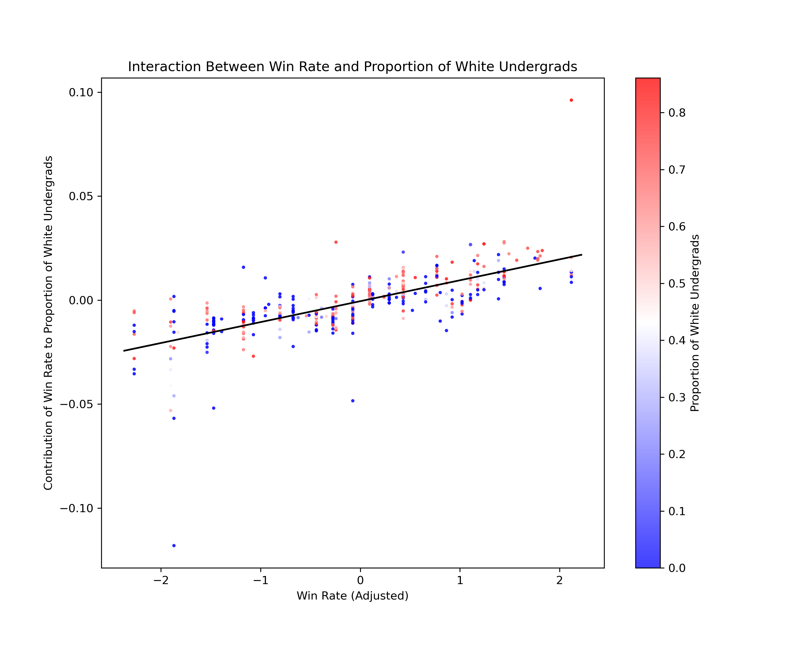
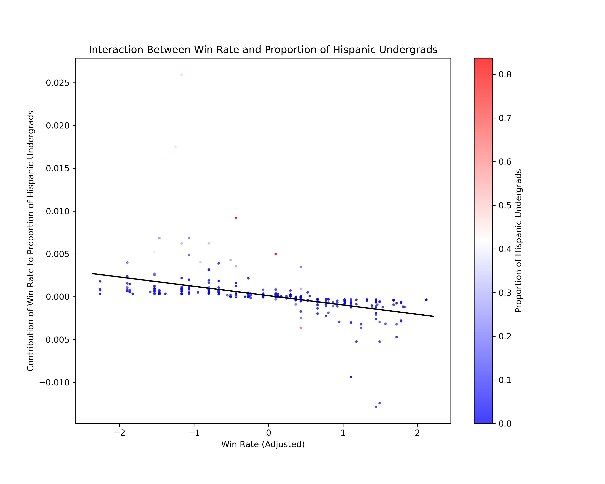

Summary
- Higher-performing football teams tend to have higher proportions of white students.
- Higher win rates are associated with lower proportions of Hispanic and Asian students.
- Effects on the Black student proportion are generally small, with a minority of schools showing a positive association with performance.

Selected figures
- White proportion vs win rate (SHAP):
  
- Hispanic proportion vs win rate (SHAP):
  
- Asian proportion vs win rate (SHAP):
  
- Black proportion vs win rate (SHAP):
  

Notes
- Figures summarize SHAP interactions/attributions for the win–loss ratio feature while controlling for expenses, tuition, and region.
- We report associations, not causal effects.

