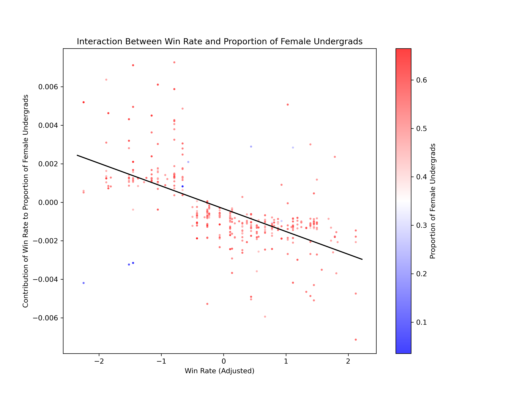

Summary
- We modeled gender proportions using the same covariates and win–loss ratio exposure.
- Effects were modest and heterogeneous across schools; we did not observe a single dominant directional effect across the population.

Selected figures
- Men proportion vs win rate (SHAP):
  
- Women proportion vs win rate (SHAP):
  

Notes
- As with race, these are associations and may reflect both selection and institutional policy effects.

